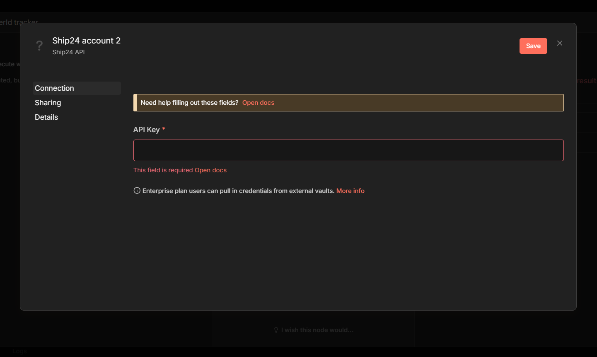
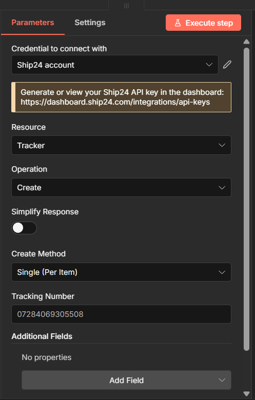
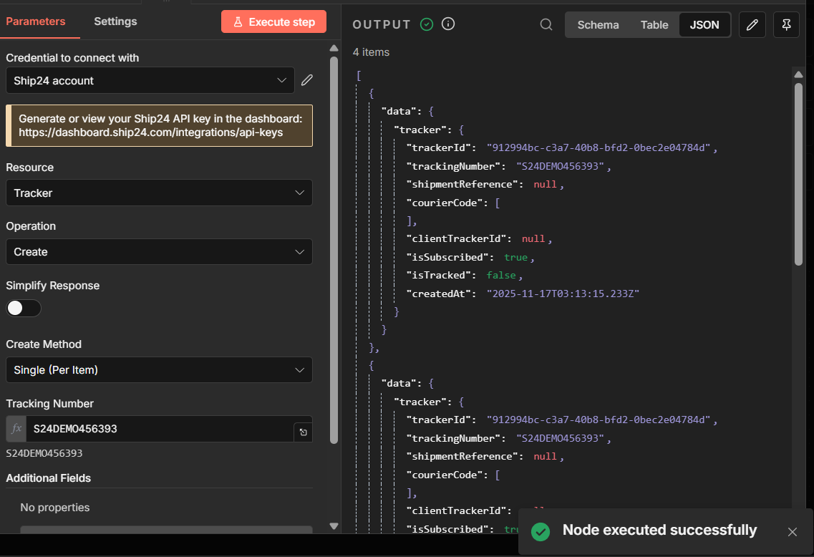
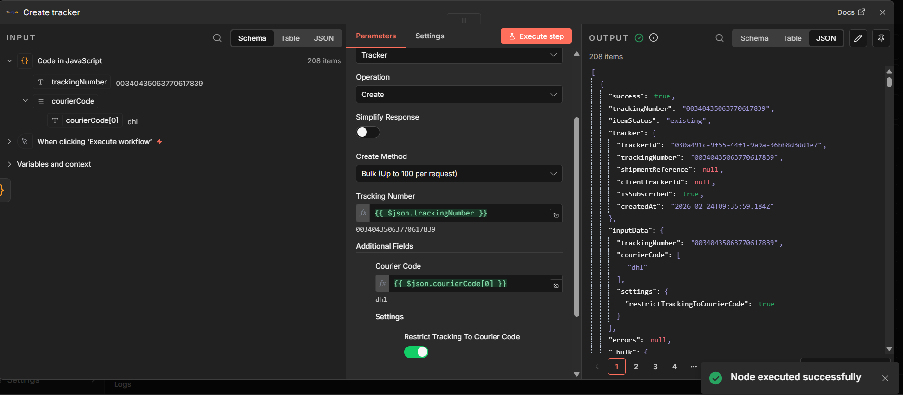
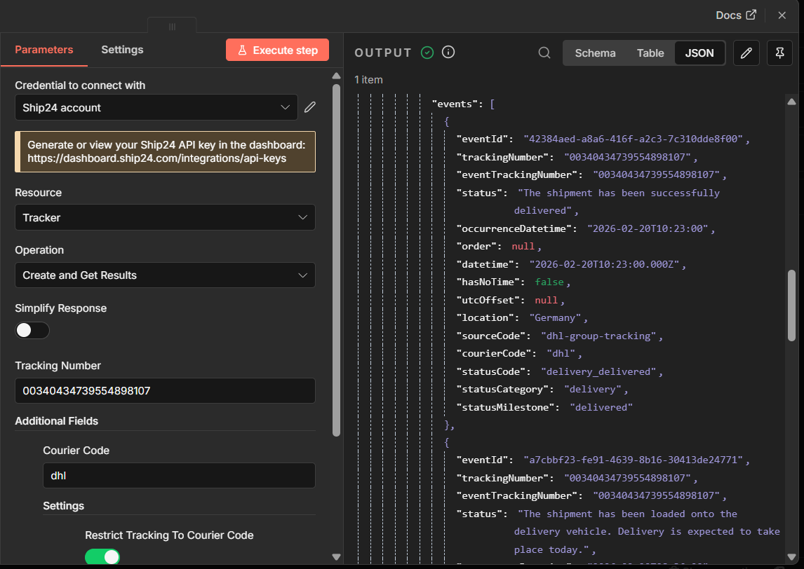
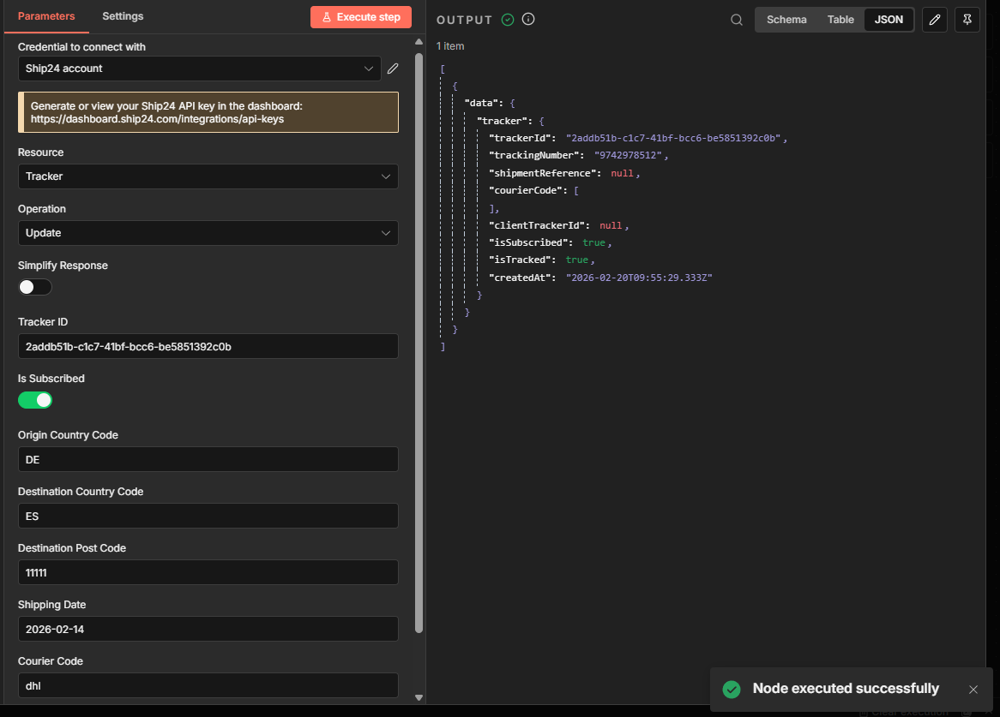
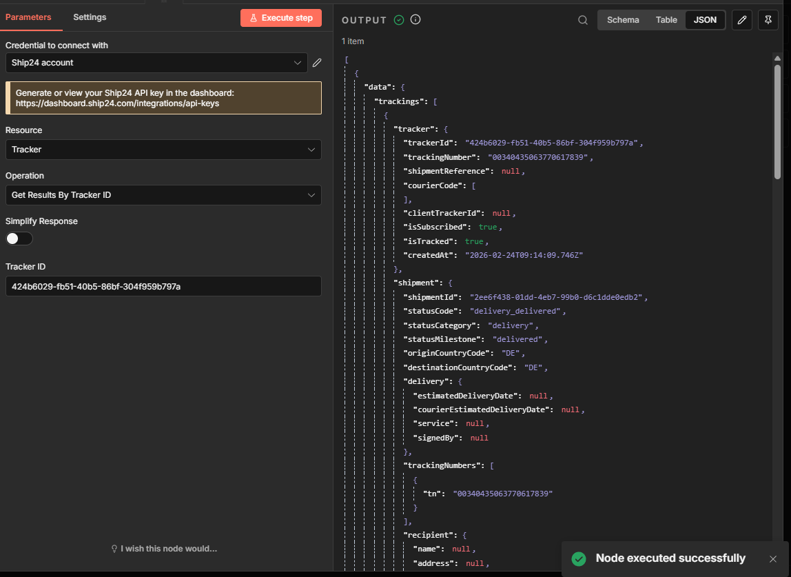
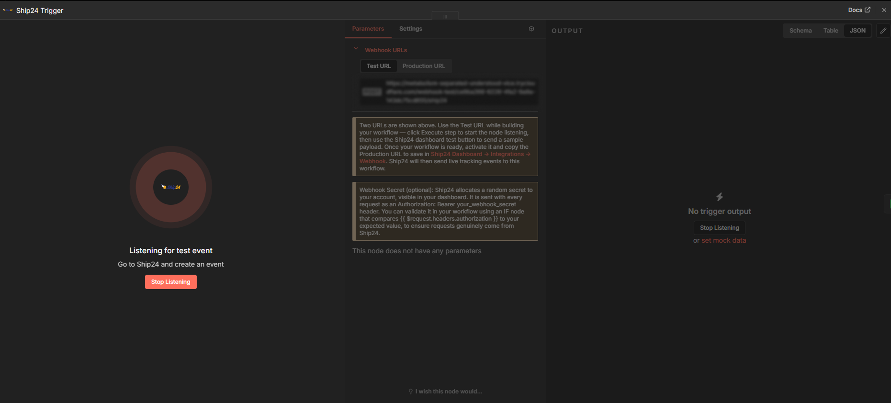
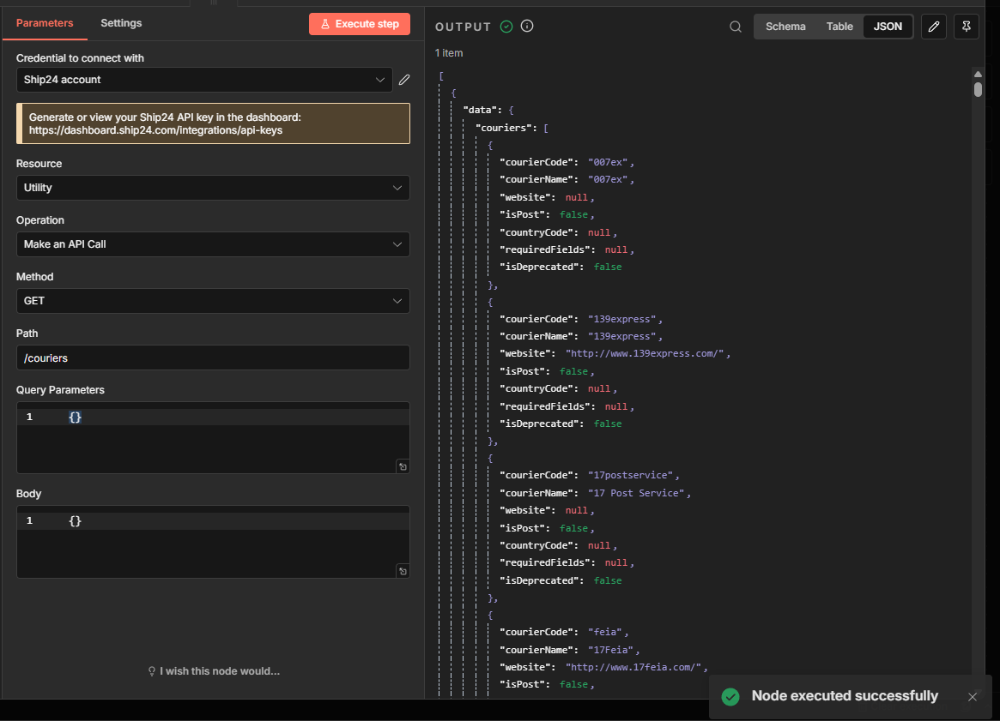

# n8n-nodes-ship24

Automate global shipment tracking inside n8n using the Ship24 API.

This package includes two nodes:

-   **Ship24** — action node for creating, updating, and querying trackers via the Ship24 API
-   **Ship24 Trigger** — trigger node that starts a workflow when Ship24 sends a tracking event webhook

------------------------------------------------------------------------

## About Ship24

Ship24 is a global shipment tracking API supporting 1500+ couriers and
marketplaces worldwide.

This package allows n8n users to:

-   Create shipment trackers
-   Retrieve tracking results
-   Update tracker subscription status
-   Process bulk shipments
-   Receive real-time tracking events via webhooks
-   Automate delivery workflows at scale

------------------------------------------------------------------------

## Features

### Ship24 (action node)

-   Single tracker creation
-   Bulk tracker creation (automatic chunking up to 100 per request)
-   Create and immediately fetch tracking results
-   Retrieve results by tracking number
-   Retrieve results by tracker ID
-   Update tracker subscription status
-   Full n8n multi-item support
-   Structured per-item error handling
-   `continueOnFail` support
-   Utility mode for advanced API access

### Ship24 Trigger (trigger node)

-   Receives real-time tracking events pushed by Ship24
-   Starts a workflow automatically on each incoming webhook
-   Configurable webhook path — unique per workflow, pre-filled with a UUID to avoid multi-instance collisions
-   Passes the raw Ship24 payload through for flexible mapping
-   Supports optional webhook secret validation via the `Authorization` header

------------------------------------------------------------------------

## Installation

### Community Node Installation

1.  Open n8n.
2.  Go to **Settings → Community Nodes**.
3.  Click **Install**.
4.  Enter:

```{=html}
<!-- -->
```
    n8n-nodes-ship24

5.  Restart n8n if required.

------------------------------------------------------------------------

## Credentials Setup

This node requires a Ship24 API key.

1.  In n8n, create new credentials.
2.  Select **Ship24 API**.
3.  Enter your API key.
4.  Save.



------------------------------------------------------------------------

## Node Overview



The **Ship24** action node provides two resources:

-   **Tracker**
-   **Utility**

------------------------------------------------------------------------

# Tracker Resource

## Create

Create shipment trackers.

Supports:

-   Single per item
-   Bulk mode (up to 100 tracking numbers per API request)



### Bulk Mode Behaviour

Bulk mode still follows standard n8n multi-item logic.

Each incoming item must contain one tracking number per item.
The Ship24 node automatically batches those items into API requests of
up to 100 tracking numbers per call.

Expected Input Format

Your previous node (Set, Code, HTTP Request, Google Sheets, etc.) should
output items like:

-   Item 1 → { "trackingNumber": "00340435063770617839" }
-   Item 2 → { "trackingNumber": "00340434788009688510" }
-   Item 3 → { "trackingNumber": "00340434788009688268" }

If your upstream system provides an array of tracking numbers, use an
Item Lists, Split Out Items, or Code node to convert the array into
multiple items before passing them to the Ship24 node.

Automatic Chunking

If more than 100 items are provided, the node automatically splits them into multiple API calls.

| Input items | API calls |
|------------|-----------|
| 80         | 1         |
| 150        | 2         |
| 250        | 3         |

Each input item returns exactly one output item.



------------------------------------------------------------------------

## Create and Get Results

Creates a tracker and immediately retrieves tracking results.

Useful when:

-   You need tracking data immediately
-   You want simplified output for automation workflows



------------------------------------------------------------------------

## Update

Update tracker subscription status (`isSubscribed` only).

-   Requires a valid `trackerId` (UUID)
-   Performs UUID validation before the API call



------------------------------------------------------------------------

## Get Results

Retrieve tracking data:

-   By tracking number
-   By tracker ID



------------------------------------------------------------------------

# Ship24 Trigger

The Ship24 Trigger node starts a workflow whenever Ship24 sends a tracking
event to your webhook URL.



## Setup

1.  Add the **Ship24 Trigger** node to a new workflow.
2.  The **Webhook Path** field is pre-filled with a unique UUID. You can leave it as-is or replace it with a memorable slug (e.g. `shop-tracking`). Each active workflow must use a different path — two workflows sharing the same path will collide and only one will receive events.
3.  Two webhook URLs are shown at the top of the node panel:
    -   **Test URL** — active while you click **Execute step** in the editor. Use this with the Ship24 dashboard test button to verify your workflow before going live.
    -   **Production URL** — active when the workflow is **activated** (toggle top-right). This is the URL to save in your Ship24 dashboard.
4.  Go to [Ship24 Dashboard → Integrations → Webhook](https://dashboard.ship24.com/integrations/webhook), paste the appropriate URL, and test or save it.

## Webhook Payload

Ship24 sends tracking events as a JSON object whose `trackings` field is an array. Each element in that array represents one tracking update:

``` json
{
  "trackings": [
    {
      "metadata": { "generatedAt": "...", "messageId": "...", "topic": "..." },
      "tracker": { "trackerId": "...", "trackingNumber": "...", "isSubscribed": true, ... },
      "shipment": { "shipmentId": "...", "statusCode": "...", "statusMilestone": "...", ... },
      "events": [ { "eventId": "...", "status": "...", "occurrenceDatetime": "...", ... } ],
      "statistics": { "timestamps": { ... } }
    }
  ]
}
```

The node passes the raw payload through. Use n8n's **Split Out** node on the
`trackings` field to process each tracking entry as a separate item.

## Webhook Secret (optional)

Ship24 allocates a random webhook secret to your account, visible in your
dashboard. It is sent with every request as:

```
Authorization: Bearer your_webhook_secret
```

To validate it, add an **IF** node after the trigger and compare
`{{ $request.headers.authorization }}` to your expected value. This ensures
requests genuinely originate from Ship24.

------------------------------------------------------------------------

# Utility Resource

The Utility resource allows advanced API access.

You can:

-   Define HTTP method
-   Define path
-   Provide custom request body
-   Provide query parameters



------------------------------------------------------------------------

## Response Modes

### Raw Mode

This node returns the full Ship24 API response (raw mode).

------------------------------------------------------------------------

## Multi-Item Behaviour

This node fully supports n8n multi-item processing:

-   One output item per input item
-   Bulk operations preserve input-to-output mapping
-   No silent drops
-   Large workflows (50+ items) supported

------------------------------------------------------------------------

## Error Handling

The node includes structured error handling for:

-   401 Unauthorized
-   404 Not Found
-   429 Rate limit
-   Invalid UUID format
-   Empty tracking number
-   Bulk mapping failures

With `continueOnFail` enabled, per-item failures return structured
objects:

``` json
{
  "success": false,
  "error": {
    "type": "request_error",
    "message": "..."
  }
}
```

This allows resilient workflow design without unexpected crashes.

------------------------------------------------------------------------

## Performance Notes

-   Bulk mode automatically chunks at 100 items per API request.
-   Large workflows are processed sequentially per chunk.

------------------------------------------------------------------------

## Development

### Build

``` bash
npm run build
```

### Lint

``` bash
npm run lint
```

### Local package test

``` bash
npm pack
```

------------------------------------------------------------------------

## License

MIT
